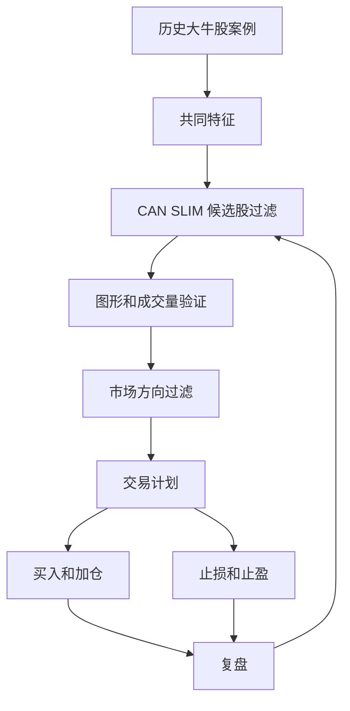

# Book Framework - How to Make Money in Stocks

Source: [Alternative Source](https://github.com/pistolla/gnidart/blob/master/How%20to%20Make%20Money%20in%20Stocks%20-%20A%20Winning%20System%20in%20Good%20Times%20and%20Bad%204th%20edition%202009.pdf)

## 全书框架

| 部分 | 章节 | 核心问题 | 输出物 |
|---|---:|---|---|
| Part I: A Winning System - CAN SLIM | Intro, Ch.1-9 | 什么样的股票在历史上成为大赢家？如何识别买点和市场环境？ | 案例卡、CAN SLIM 检查表、市场状态表 |
| Part II: Be Smart from the Start | Ch.10-13 | 什么时候卖？怎样让亏损不失控？常见错误是什么？ | 止损规则、止盈规则、仓位规则、错误清单 |
| Part III: Investing Like a Professional | Ch.14-20 | 如何把个股系统放进行业、新闻、工具和组合管理里？ | 行业主题复盘、观察名单流程、最终交易守则 |

## 系统主线



## 章节优先级

### P0 - 先学，直接影响风险

| 章节 | 为什么优先 | 你要掌握的概念 |
|---|---|---|
| Ch.10 When You Must Sell and Cut Every Loss | 新手和进阶者最容易被亏损拖垮 | 7%-8% 硬止损、承认错误、卖出不等于亏损开始 |
| Ch.11 When to Sell and Take Your Worthwhile Profits | 盈利也需要规则 | 20%-25% 利润区、强势股持有例外、异常放量和顶部信号 |
| Ch.12 Money Management | 决定一笔错单会不会伤到组合 | 单笔风险、集中度、加仓、流动性、避免过度复杂工具 |
| Ch.13 Costly Common Mistakes | 把自己的坏习惯显性化 | 向下摊平、买便宜、听消息、无市场规则、没有卖出计划 |
| Ch.9 Market Direction | 个股再好也要看大盘环境 | confirmed uptrend、distribution、rally attempt、不要和市场硬抗 |

### P1 - 建立进攻能力

| 章节 | 作用 | 输出 |
|---|---|---|
| Ch.1 Greatest Stock-Picking Secrets | 用 100 张历史赢家图训练模式识别 | 20 张案例卡 |
| Ch.2 How to Read Charts | 把故事转成供需证据 | base/pivot/volume/RS 标注练习 |
| Ch.3-Ch.8 CAN SLIM | 建立候选股过滤框架 | 观察名单字段和评分 |
| Ch.15 Sectors and Industry Groups | 避免只看单股，忽略风口位置 | 行业主题周报 |
| Ch.17 Watching the Market and Reacting to News | 训练新闻不等于交易信号 | 新闻反应记录 |

### P2 - 补充理解

| 章节 | 适合什么时候读 | 读法 |
|---|---|---|
| Ch.14 More Models of Great Winners | 图形训练不够时 | 当案例库补充 |
| Ch.16 How to Use IBD | 理解 O'Neil 原系统的数据入口 | 映射成自己的字段，而不是照搬工具 |
| Ch.18 Mutual Funds | 想理解基金持有和长期配置时 | 泛读 |
| Ch.19 Pension and Institutional Portfolios | 想理解机构视角时 | 泛读 |
| Real Success Stories | 需要动机和执行纪律提醒时 | 读故事，提炼行为原则 |

## 不要跳过但可以换读法的部分

- 如果你已经懂动量和突破：Ch.1-Ch.2 仍然要读，但重点放在“什么是假突破、什么是 faulty base、哪里证明买错”。
- 如果你已经懂基本面：Ch.3-Ch.5 仍然要读，但重点放在“增长是否加速、销售是否配合、N 是否已经被价格确认”。
- 如果你已经懂仓位：Ch.10-Ch.12 仍然要读，而且要转成硬规则。懂风险和执行风险不是同一件事。
- 如果你已经会看新闻：Ch.17 仍然要读，重点是新闻之后价格和成交量怎么反应，而不是新闻本身多好听。

## 读完本书后应该拥有的系统

```text
强行业 -> 强公司 -> 强增长 -> 新因素 -> 正确 base -> 放量突破
      -> 市场支持 -> 明确止损 -> 仓位可控 -> 复盘闭环
```

