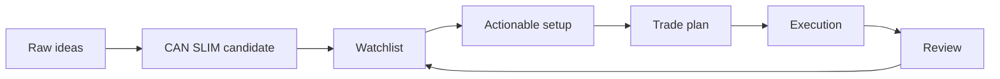

# Watchlist to Trade Workflow

Source: [Alternative Source](https://github.com/pistolla/gnidart/blob/master/How%20to%20Make%20Money%20in%20Stocks%20-%20A%20Winning%20System%20in%20Good%20Times%20and%20Bad%204th%20edition%202009.pdf)

## 目标

把“看到强势股”变成一个可复盘流程。筛选结果不直接等于买入信号，它只是漏斗的第一层。

## 漏斗分层

| 层级 | 定义 | 允许动作 |
|---|---|---|
| Raw ideas | 动量、新闻、行业、财报、朋友提到、榜单中看到 | 收集，不判断 |
| CAN SLIM candidate | 基本面、相对强度、行业、流动性初步通过 | 做研究 |
| Watchlist | thesis 清楚，图形可能正在构建 | 设提醒，等待 |
| Actionable setup | 接近 pivot、回踩或二次买点，市场支持 | 写交易计划 |
| Trade plan | 买点、止损、仓位、加仓、卖出都明确 | 才能执行 |
| Review | 交易或未交易都复盘 | 保留证据，更新规则 |

## 观察名单字段

| 字段 | 目的 |
|---|---|
| ticker | 标的 |
| company thesis | 一句话说明为什么它可能成为赢家 |
| industry/theme | 所属强行业或主题 |
| C evidence | 最近季度 EPS 和销售 |
| A evidence | 年度盈利、ROE、利润质量 |
| N factor | 新产品、新管理层、新市场、新高、新周期 |
| RS behavior | 是否强过大盘和同行 |
| volume behavior | 突破放量、回调缩量、异常派发 |
| base type | cup-with-handle、double bottom、flat base 等 |
| pivot | 计划买点 |
| invalidation | thesis 或 setup 失效点 |
| market status | confirmed uptrend、under pressure、correction |
| action | ignore、research、watch、plan、execute、review |

## 每日流程

1. 判断市场状态。市场不支持时，只减少动作，不增加理由。
2. 看行业和主题强弱。
3. 检查观察名单中是否有股票接近买点。
4. 对接近买点的股票过 [[04-can-slim-checklist]]。
5. 只有 actionable setup 才写交易计划。

## 每周流程

- 删除 thesis 失效的标的。
- 删除相对强度明显转弱的标的。
- 把强行业中的新候选股加入 raw ideas。
- 对前 10 个候选股做图形标注。
- 写一段市场状态总结。

## 不交易清单

- 大盘处于 correction，且个股只是普通突破。
- 个股离 pivot 太远，只能等下一次整理。
- 业绩和销售没有支持，只有故事。
- 行业弱，个股只是短期反弹。
- 止损距离太远，仓位算出来过小或不值得做。
- 需要说服自己很多遍才敢买。

