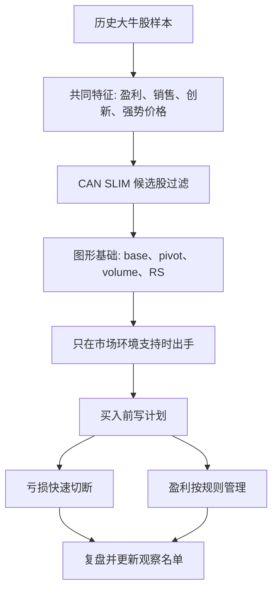

# Book Framework - How to Make Money in Stocks

Source: [Alternative Source](https://github.com/pistolla/gnidart/blob/master/How%20to%20Make%20Money%20in%20Stocks%20-%20A%20Winning%20System%20in%20Good%20Times%20and%20Bad%204th%20edition%202009.pdf)

## 全书一句话

用过去一百多年大牛股的共同特征，建立一套成长股选择、图形买点、市场择时、卖出和资金管理系统。

## 三大部分

| 部分 | 章节 | 作用 | 学习重点 |
|---|---:|---|---|
| Part I: CAN SLIM 系统 | Intro, Ch.1-9 | 建立选股和择时模型 | 历史赢家、图形、C/A/N/S/L/I/M |
| Part II: 从一开始就聪明 | Ch.10-13 | 防止亏损扩大，建立卖出和仓位规则 | 止损、止盈、资金管理、常见错误 |
| Part III: 像专业人士一样投资 | Ch.14-20 | 把系统放进市场、行业、工具和长期管理里 | 行业主题、工具使用、新闻反应、最终规则 |

## 主线逻辑

## 章节功能图

### Introduction - 为什么普通投资者也要建立规则

开篇建立反共识框架：不要因为便宜而买，不要向下摊平，不要过度迷信低 PE、股息或账面价值；要关注盈利增长、销售增长、价格和成交量、行业领导地位、创新产品，以及市场供需。

### Chapter 1 - 历史赢家模型库

这一章不是普通阅读材料，更像训练眼睛的案例库。重点不是记住每只股票，而是观察大牛股启动前常见的组合：强增长、强相对强度、机构需求、从正确底部突破、突破时放量、随后能维持趋势。

你的做法：挑 20 张图深读，每张只回答三个问题：

- 它启动前的基本面强在哪里？
- 它的 base 和 pivot 在哪里？
- 如果你买错了，哪里证明这笔交易失效？

### Chapter 2 - 图表阅读和择时

图形的作用是把基本面故事转化为供需证据。重点学习 base、cup with handle、double bottom、flat base、high tight flag、pivot point、volume dry-up、breakout volume、faulty base。

这一章对你最重要，因为你已经在关注 breakout 和 setup。下一步是区分“真准备突破”和“已经过度延伸”。

### Chapters 3-9 - CAN SLIM 七要素

| 字母 | 含义 | 你要问的问题 |
|---|---|---|
| C | Current quarterly earnings and sales | 最近季度盈利和销售是否大幅增长或加速？ |
| A | Annual earnings growth | 多年盈利是否持续增长，ROE 是否有质量？ |
| N | New | 是否有新产品、新管理层、新高或新商业周期？ |
| S | Supply and demand | 股本、成交量、突破放量是否显示需求强？ |
| L | Leader or laggard | 它是行业和市场中的领先股，还是落后股补涨？ |
| I | Institutional sponsorship | 是否有质量较高、逐步增加的机构参与？ |
| M | Market direction | 大盘是否支持做多？是否出现确认性转强或分配压力？ |

### Chapters 10-13 - 先活下来，再谈赚钱

O'Neil 的系统非常强调卖出和风控。对你来说，这部分应该提前读，因为很多新手最大的问题不是不会找到强股，而是买入后没有退出规则。核心是：亏损不能自由生长，盈利也不能完全凭感觉处理。

### Chapters 14-17 - 从个股扩展到行业和市场

这部分把个股系统放到更大的环境里：更多历史赢家、行业主题、IBD 工具和新闻反应。你可以把 IBD 的概念映射到自己的数据流程：行业强度、相对强度、成交量变化、财报增长、观察名单和告警。

### Chapters 18-19 - 基金和机构视角

这两章对你的当前阶段不是最高优先级。可以当作理解机构行为、共同基金和长期组合管理的补充材料。

### Chapter 20 - 规则回顾

这一章适合当作复习入口。它把全书压缩成规则清单：买强不买弱、买增长不买便宜、看图形和成交量、严格止损、关注市场方向、避免过度分散和无关工具。

## 读书顺序建议

不建议从头到尾线性阅读。更适合你的顺序：

1. Chapter 20 - 先建立规则全景。
2. Chapters 10-12 - 先把亏损、止盈和仓位搞清楚。
3. Chapters 1-2 - 训练图形和买点。
4. Chapters 3-9 - 分模块学习 CAN SLIM。
5. Chapters 15-17 - 接入行业、工具和新闻反应。
6. Chapter 14, 18, 19 - 有余力再读案例和机构视角。
