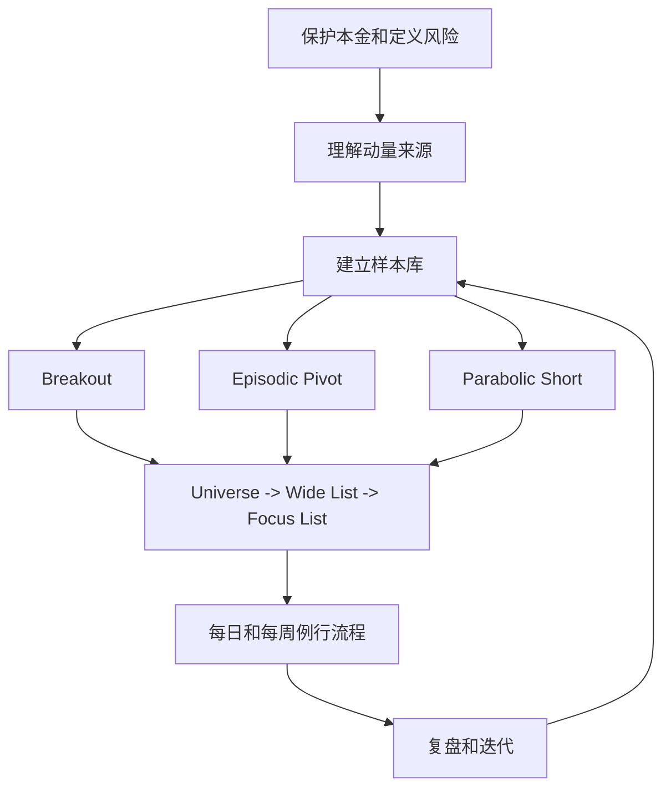

# Qullamaggie Swing Trade 学习地图

> [!warning] 风险边界
> 这套笔记是学习和训练系统，不是投资建议。任何实盘前都要先确定单笔风险、仓位上限、止损位置和退出规则。你真正要学的不是“买哪个股票”，而是如何识别少数高质量 setup，并在错的时候亏很小。

## 核心路线

## 怎么学

1. 先读完 [[01 - 先保护本金：风险、仓位和交易资格]]，不要跳过。Qullamaggie 的方法看起来激进，但底层是明确风险、快速认错、让少数大赢家覆盖大量小亏损。
2. 再读 [[02 - 动量为什么会发生：催化剂、相对强度和市场环境]]，理解为什么 earnings、sector rotation、FDA、政策、订单等催化剂会引发快速重估。
3. 用 [[03 - 建立自己的样本库：从看图到形成边际]] 开始训练眼睛。没有样本库，就只是在模仿术语。
4. 依次学习三个 setup：
   - [[04 - Setup 一：Breakout]]
   - [[05 - Setup 二：Episodic Pivot EP]]
   - [[06 - Setup 三：Parabolic Short 和 Parabolic Long]]
5. 把机会筛成少数高质量候选：[[07 - 从股票池到 Focus List]]
6. 固化执行节奏：[[08 - 每周和每日例行流程]]
7. 按 [[09 - 30 天训练计划]] 做一个月，只允许观察、建库、模拟和极小风险练习。

## 这套方法的四个关键词

- **Setup**：只交易少数反复出现、有风险收益优势的形态。
- **Catalyst**：价格快速重估通常需要触发器，尤其是意外 earnings、guidance、行业主题和重大新闻。
- **Volume**：大成交量是机构参与和市场注意力变化的证据之一。
- **Routine**：每周找机会，每日缩小名单，盘后复盘，长期积累样本。

## 最低实盘门槛

- 至少完成 100 张 setup 样本卡，其中 Breakout 50 张，EP 30 张，Parabolic 20 张。
- 能独立写出每笔交易的 entry、stop、position size、invalidation、sell rule。
- 模拟或极小仓位执行 20 笔，且每笔都能在事后解释是否遵守计划。
- 没有连续 3 次违反止损或追高冲动交易。

## 模板

- [[模板 - Setup 样本卡]]
- [[模板 - 交易计划卡]]
- [[模板 - 日复盘与周复盘]]
- [[99 - 来源索引：Qullamaggie 与站内资料]]
