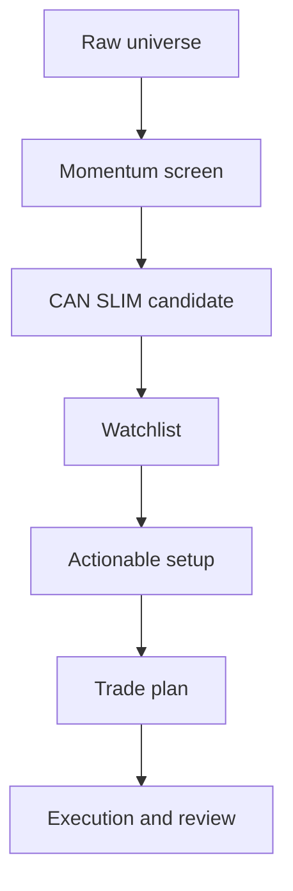

# From Screener to CAN SLIM Watchlist

## 你的现有基础

当前 repo 里已有 `screen_us_momentum.py` 和 `analyze_screen.py`，大致能完成：

- 美股普通股 universe 过滤。
- 市值、价格、成交额过滤。
- 近 1 个月收益率排名。
- top 5% 动量股输出。
- 行业和板块分布分析。
- TradingView 收盘价校验辅助。

这很适合做 CAN SLIM 的第一层：发现强势候选股。但它还不能直接回答“这只股票是否可以买”。

## 四层漏斗



## Level 1 - Momentum screen

现有筛选已经覆盖：

- 流动性：成交额。
- 可交易性：价格、市值。
- 动量：1 个月涨幅。
- 行业聚集：sector / industry lift。

输出只代表：这只股票近期强，值得研究。

## Level 2 - CAN SLIM candidate

给每只 top momentum 股票补充这些字段：

| 字段 | 对应 CAN SLIM | 记录方式 |
|---|---|---|
| latest_eps_growth | C | 最近季度 EPS 同比 |
| latest_sales_growth | C | 最近季度收入同比 |
| eps_acceleration | C | 最近 2-3 季度是否加速 |
| annual_eps_trend | A | 最近 3 年 EPS 趋势 |
| roe | A | ROE 或质量替代指标 |
| new_factor | N | 新产品、新管理层、新高、新周期 |
| volume_signal | S | 突破或上涨日是否放量 |
| relative_strength | L | 相对 SPY/QQQ 或行业是否创新高 |
| industry_rank | L | 行业是否领先 |
| fund_ownership_trend | I | 机构持有是否改善 |
| market_state | M | 大盘是否允许做多 |

## Level 3 - Watchlist

进入观察名单的股票必须满足：

- 至少 4 个 CAN SLIM 模块是绿灯。
- 没有红色硬伤。
- 图形正在形成 base 或接近合理买点。
- 行业不是明显弱势。
- 你能用两句话说清楚 thesis 和失效条件。

## Level 4 - Actionable setup

进入可行动层必须满足：

- 买点清晰。
- 离买点不远。
- 止损点清晰。
- 当前市场状态允许。
- 突破或回踩有成交量/价格行为支持。
- 已写 [[obsidian/How to Make Money in Stocks - CAN SLIM/05-trade-plan-template|05-trade-plan-template]]。

## 建议的 CSV 字段

可以在后续扩展 screener 时输出：

```text
symbol
name
sector
industry
one_month_return
relative_strength_vs_spy
relative_strength_vs_industry
avg_dollar_volume
latest_eps_growth
latest_sales_growth
annual_eps_trend
roe
new_factor_note
base_type
pivot_price
distance_to_pivot_pct
stop_price
market_state
watchlist_status
notes
```

## 每周工作流

1. 周末运行 momentum screen。
2. 只取 top 20-30 做人工 CAN SLIM 审核。
3. 删除没有基本面或没有图形结构的纯涨幅股。
4. 给剩余股票标注 base、pivot、stop。
5. 只把 3-5 只最接近买点的股票放入 action list。
6. 交易日前先看大盘状态，再看个股。

## 常见陷阱

- 把 top gainer 当作 buy list。
- 只看涨幅，不看 base 是否健康。
- 只看个股，不看市场方向。
- 只看技术形态，不看盈利和销售是否支持。
- 观察名单无限膨胀，导致真正接近买点的股票没人盯。

## 你的下一步

先不要马上改很多代码。第一步建议手工给最近一次 top 20 输出补充 CAN SLIM 字段。等你连续两周都按同一字段做复盘，再把稳定字段自动化。
